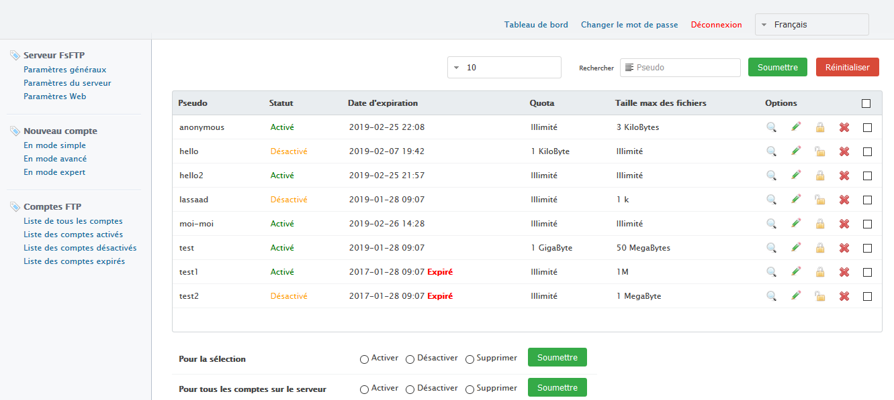
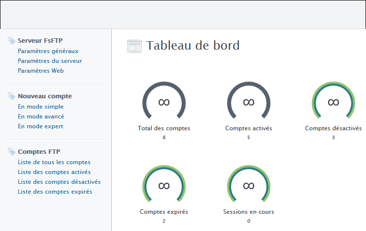

<i>This file exists in several languages. <a href="README.md"><u>Click here to read it in English</u></a></i>

Le <i>serveur FsFTP (<b>F</b>ast and <b>S</b>ecure <b>FTP</b> Server) est un serveur FTP, SFTP, FTPS & HTTPS hautement configurable et sous licence GPL. Logiciel compatible avec Windows et Linux</i>  

<b>Démo à l'adresse <a href="https://localhost:3000/" target="_blank">https://localhost:3000/</a></b>

<h2>Serveur FsFTP</h2>

<li><b><i>Prend en charge les connexions sécurisées SSL et TLS (explicite et implicite). FTP, FSTP et FTPS</i></b></li>  

<li><b><i>Panneau de contrôle d'administration multi-langues (anglais et français) pour la configuration du serveur</i></b></li>  

<li><b><i>Nombre maximal de connexions</i></b></li> 
Nombre maximal de connexions à accepter  

<li><b><i>Nombre maximal de connexions par utilisateur</i></b></li> 
Nombre maximal de connexions à accepter pour chaque utilisateur (par même utilisateur)  

<li><b><i>Nombre maximal de connexions par IP</i></b></li> 
Nombre maximal de connexions à accepter pour chaque adresse IP (par même adresse IP)  

<li><b><i>IP à interdire</i></b></li> 
Les connexions à partir de ces adresses IP seront refusées  

<li><b><i>Délai d'inactivité</i></b></li> 
Durée maximale d'inactivité, en secondes, avant la déconnexion  

<li><b><i>Compte anonyme (anonymous)</i></b></li> 

<h2>Compte illimité</h2>

 Pour chaque compte vous pouvez configurer :</i></b></li> </ p>

<li><b><i>Statut</i></b></li> 
Activer / désactiver le compte  

<li><b><i>Date d'expiration</i></b></li>  

<li><b><i>Forcer les connexions sécurisées à ce compte</i></b></li> 
Le serveur FsFTP prend en charge les connexions sécurisées SSL et TLS (dans Explicit et Implicit). Vous pouvez donc exiger que les connexions à ce compte soient sécurisées. Ainsi, toutes les connexions non chiffrées seront rejetées. Utile si ce compte va partager des données confidentielles.  

<li><b><i>Répertoire d'utilisateurs</i></b></li>  

<li><b><i>Autorisations de fichier</i></b></li> 
- Read : peut lire (télécharger) fichier / contenu 
- New : peut créer un nouveau fichier ou écrire du contenu dans des fichiers existants 
- Delete : peut supprimer des fichiers 
- Rename : peut renommer des fichiers 
- Chmod : peut appliquer Chmod 
- Append : Peut ajouter du contenu dans un fichier existen  

<li><b><i>Autorisations de répertoire</i></b></li> 
- Creat : créer un nouveau répertoire ou un sous-dossier</i></b></li> 
- Delete : pouvez supprimer un répertoire ou un sous-dossier et leur contenu</i></b></li> 
- Rename : permet de renommer des répertoires et des sous-dossiers</i></b></li> 
- Chmod : peut appliquer Chmod</i></b></li> 
- List : liste tous les fichiers / répertoire pour ce compte  

<li><b><i>Extension de fichier interdite</i></b></li> 
Vous pouvez spécifier plusieurs valeurs en les séparant par une virgule "," Par exemple: "exe, bat, cmd, vb, vbs, vbe"  

<li><b><i>IP autorisées</i></b></li> 
Le compte ne peut se connecter qu'à partir de ces adresses IP. Toute connexion provenant d'une adresse IP non répertoriée ici sera rejetée  

<li><b><i>Heures de connexion au compte</i></b></li> 
Vous pouvez définir des restrictions sur les heures de connexion au compte.  

<li><b><i>Quota</i></b></li> 
Cela limite l'utilisateur à une quantité fixe d'utilisation du disque (contrôle de quota de disque).  

<li><b><i>Taille maximale du fichier</i></b></li> 
Les utilisateurs ne pourront pas envoyer de fichiers dont la taille dépasse cette valeur.  

<li><b><i>Afficher de force les fichiers et répertoires masqués</i></b></li> 
Par défaut, les fichiers et les répertoires avec l'attribut caché (qui commencent par un point ".", Par exemple: .htaccess, .passwd, .file, etc ...) ne seront pas affichés pour les utilisateurs dans l'explorateur. Vous pouvez forcer leur affichage en définissant cette directive sur True  

<li><b><i>Forcer l'affichage des fichiers et répertoires temporaires</i></b></li> 
Par défaut, les fichiers et les répertoires qui se terminent par le caractère ~ "tilde" (par exemple: tmp~, newFile~, myDirectory~ ...) ne seront pas affichés pour les utilisateurs dans l'explorateur. Vous pouvez ainsi forcer leur affichage  

<li><b><i>Enregistrer les journaux séparément</i></b></li> 
Enregistrez les journaux pour cet utilisateur séparément

  
 

  
 

  
