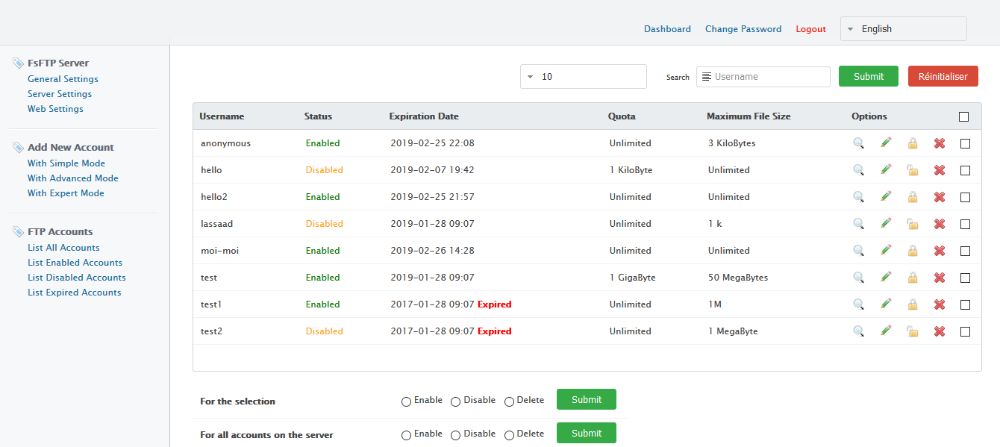
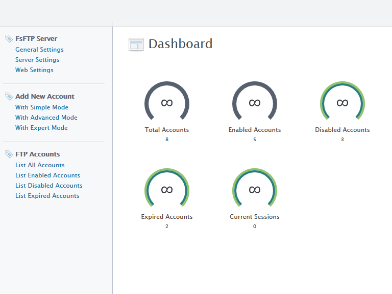

<i>Ce fichier existe en plusieurs langues. <a href="LISEZ-MOI.md"><u>Cliquez ici pour le lire en Français</i></a></i>

<i>FsFTP Server (<b>F</b>ast and <b>S</b>ecure <b>FTP</b> Server) is a Highly configurable Free FTP, FTPS & HTTPS server software compatible with Windows and Linux</i>  

<b>Demo at <a href="https://localhost:3000/" target="_blank">https://localhost:3000/</a></b>

<h2>FsFTP Server</h2>

<li><b><i>Full supports secure SSL and TLS connections (in Explicit and Implicit). FTP and FTPS</i></b></li> 

<li><b><i>Multi-lang (English and French) Admin Controle Panel to configure server</i></b></li> 

<li><b><i>Max Connections</i></b></li> 
Max number of control connections to accept  

<li><b><i>Max Connections Per User</i></b></li> 
Max number of control connections to accept for each user (per same user)  

<li><b><i>Max Connections Per Ip</i></b></li> 
Max number of control connections to accept for each IP Address (per same IP Address)  

<li><b><i>IPs To ban</i></b></li> 
Connections from these IPs will be rejected  

<li><b><i>Idle Timeout</i></b></li> 
Maximum inactivity time, in seconds, before disconnecting  

<li><b><i>Anonymous account compatible</i></b></li> 

<h2>Unlimited Account</h2>

For each account you can configure :</i></b></li> 

<li><b><i>Status</i></b></li> 
Enable/disable account  

<li><b><i>Expiration Date</i></b></li> 

<li><b><i>Force secure connections to this account</i></b></li> 
FsFTP Server supports secure SSL and TLS connections (in Explicit and Implicit), so you can require connections to this account to be secure, so any connections that are not encrypted will be rejected. Useful if this account will share confidential data.   	

<li><b><i>User Directory</i></b></li> 
Each account can have its own directory  

<li><b><i>Autorisations des fichiers</i></b></li> 
- Read: can Read (download) file/contents 
- New: Can Create a new file or write contents in existen files 
- Delete: Can Delete Files 
- Rename: Can rename Files 
- Chmod: Can apply Chmod 
- Append: Can append contents in an existen file  

<li><b><i>File Access Permissions</i></b></li> 
Access rights (<b>CHMOD</b>) manage what actions users have the right to perform on files (read, write, and execute)  

<li><b><i>Directory Permissions</i></b></li> 
- Create: Can Create a new Directory or Subfolder</i></b></li> 
- Delete: Can Delete a Directory or Subfolder and their contents</i></b></li> 
- Rename: Can rename directorys and subfolders</i></b></li> 
- Chmod: Can apply Chmod</i></b></li> 
- List: will list all files/directory for this account  

<li><b><i>Directory Access Permissions</i></b></li> 
Access rights (<b>CHMOD</b>) manage what actions users have the right to perform on Directories (read, write, and execute)  

<li><b><i>Banned File Extension</i></b></li> 
You can specify multiple values by separating them with a comma ","Eg: "exe, bat, cmd, vb, vbs, vbe"  

<li><b><i>Allowed IPs</i></b></li> 
The account can only connect from these IPs. Any connection from an IP not listed here will be rejected  

<li><b><i>Account Login Times</i></b></li> 
You can set restrictions on account login times.  

<li><b><i>Quota</i></b></li> 
This restricts the user to a fixed amount of disk usage (disk quota control).  

<li><b><i>Maximum File Size</i></b></li> 
Users will not be able to send files whose size exceeds this value.  

<li><b><i>Force Display Hiden Files and Directories</i></b></li> 
By default, files and directories with the hidden attribute (which start with a dot "." eg: .htaccess, .passwd, .file, etc ...) will not be displayed to users in the explorer. You can force their display by setting this directive to True  	

<li><b><i>Force Display Temporary Files and Directories</i></b></li> 
By default, files and directories that end with the ~ "tilde" character (eg: tmp~, newFile~, myDirectory~ ...) will not be displayed to users in the explorer. You can force their display by setting this directive to Enable  	

<li><b><i>User and Group</i></b></li> 

User/Group: The name (or #number) of the User/Group to run this account as. 
These options are useful if you use eg suEXEC and/or suPHP or for web-hosting  

<li><b><i>Account Logging</i></b></li> 
Enable/Disable logs for this account. All activities will be saved as <b>Xferlog format</b>  

<li><b><i>Save logs separately</i></b></li> 
Save the logs for this user separately  

<li><b><i>Anti Brute-Force attack</i></b></li> 
FsFTP Server has an Anti Brute-Force attack  

 
 

 
 

  